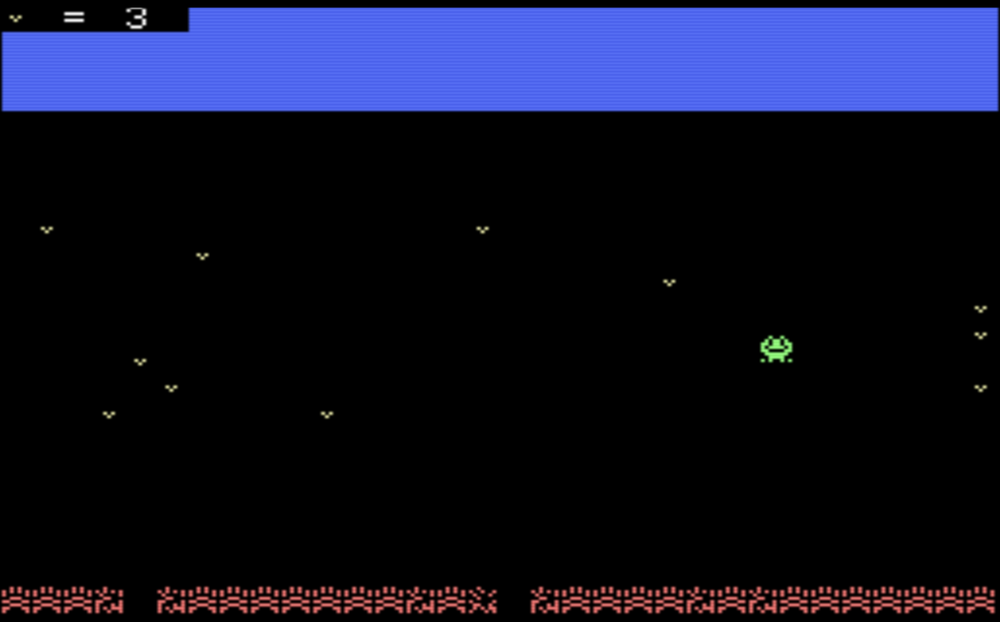
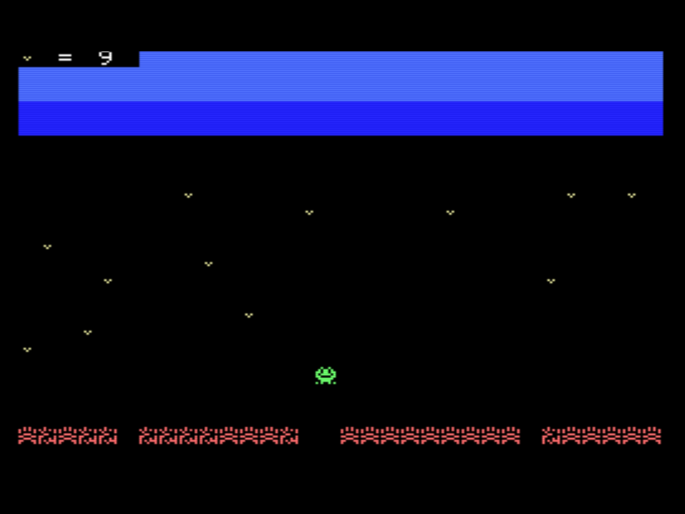
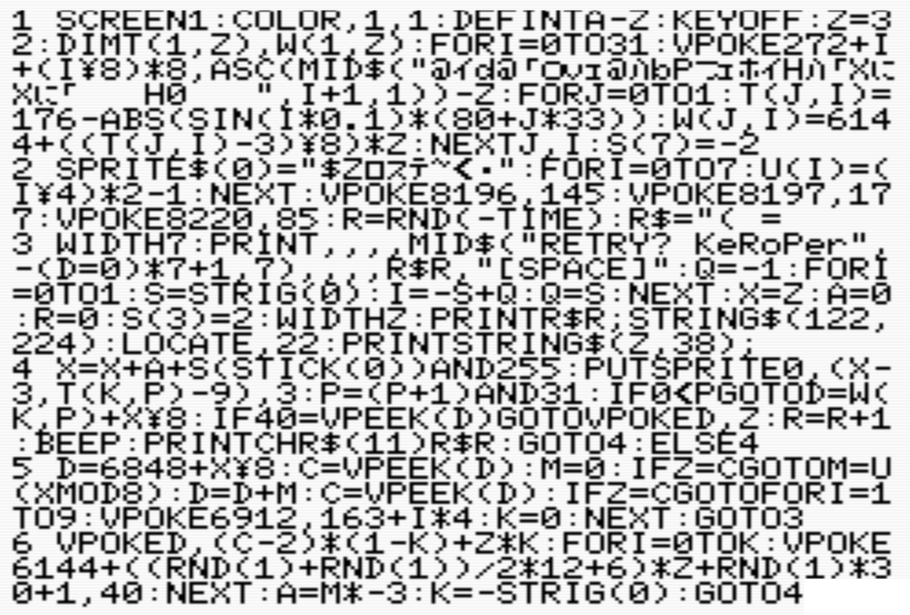
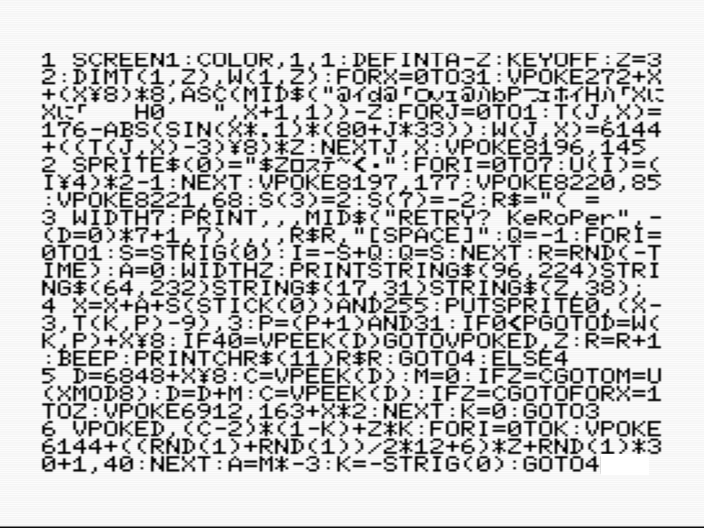

# MSXBASIC用ゲーム「KeRoPer -ケロッパー-」

** Ver 1.1が追加されました！！ **

## ストーリー
とにかくジャンプが止まらないカエルのケロッパーくん
今日は橋の上に大好物の「ハムシ」の群れをみつけたみたい
だけど困ったことに、この橋はとても古くジャンプの衝撃で簡単に壊れてしまうんだ

## ゲームの目的
カエルのケロッパーくんを操作して、橋の上の「ハムシ」をひたすら食べよう
橋から落ちたらゲームオーバーだ、君は何匹食べられるかな？
橋は３回踏みつけると壊れてしまうから気をつけて

## 操作方法
カーソル左右で移動
スペースで大ジャンプ

## 攻略のヒント＆テクニック
大ジャンプ後の着地は橋を１回で壊してしまう…でも良いこともあるかも
橋の隅に着地すると斜め方向に飛んでしまうけど、これを利用すれば通常届かない距離を飛び越えられるぞ

## あとがき
モッサリしない操作感と盛り上がったところでサクッと終われるゲームバランスを目指して作りました。
ある程度上達すると「しぶとく生き延びる俺スゲー」を味わえます
まずは50匹を目標に是非やり込んで見て下さい。

制作　ヒコピコ　https://x.com/hicopico_koubou

## ソースコード

** Ver 1.1が追加されました！！ **

# 編集後記

## 美しい！！
当プロジェクト投稿者第1号、ヒコピコ様からの投稿になります。

ヒコピコ様からもらったコードを読むと1行目がアツい。
FORループの重ねかたが秀逸だなあと思いました。
あとは2行目の末尾、R$="( = 
あれ？ダブルクォートで閉じなくもいいの？って思ったんですが、Syntax Errorにはならないみたいですね。
BASICの奥深さを知ったところです。

そして**ゲーム性がまた良い**です。

1画面とは思えない操作性。
ジャンプボタンを押したり、着地時にキャラの角に着地したり、画面の端をまたぐことでゲーム性が変わるギミック。

ハムシ50匹を目標に！とのことですがゲーム下手な私には35、6でゲームオーバーです。
くやしいです！！

(Ver 1.1)
青空が追加されたようです。1行目がフルフルでコードが詰まってます。圧巻です。

- 編集部：SAILORMAN

# MSX BASIC Game "KeRoPer - Keropper -"

** Ver 1.1 has been added!! **

## Story
The frog Keropper-kun just can't stop jumping.  
Today, it looks like he spotted a swarm of his favorite "Hamushi" on the bridge.  
But there's a problem: this bridge is very old and breaks easily from the impact of his jumps.

## Game Objective
Control the frog Keropper-kun and eat as many "Hamushi" on the bridge as you can.  
If you fall off the bridge, it's game over. How many can you eat?  
Be careful — the bridge breaks after being stomped on 3 times.

## Controls
Move left/right with cursor keys  
Big jump with Space

## Tips & Techniques
Landing after a big jump destroys the bridge in a single step… but that might actually work in your favor.  
If you land on the very edge of the bridge, you'll be launched diagonally. Use this trick to jump distances you normally couldn't reach!

## Afterword
I made this game aiming for snappy, non-sluggish controls and a balance that gets exciting and ends quickly.  
Once you get good, you can enjoy the feeling of "I'm so awesome for stubbornly surviving this long!"  
Please play it thoroughly with a goal of 50 Hamushi to start!

**Created by** Hicopico  
https://x.com/hicopico_koubou

## Source Code

** Ver 1.1 has been added!! **

# Editor's Note

## Beautiful!!
This is the very first submission to the project — from contributor No. 1, Hicopico.

When I read the code Hicopico sent, the first line was already on fire.  
The way the FOR loops are nested is brilliant.  
Also, at the end of the second line: `R$="( =`  
I thought, “Wait, isn’t it supposed to close the double quote?” But it doesn’t cause a Syntax Error.  
I just learned how deep BASIC really is.

And the **gameplay is excellent** too.

The controls feel far better than you’d expect from a single-screen game.  
The gameplay changes completely depending on how you press the jump button, land on the corner of the character, or cross the edge of the screen — those little gimmicks are fantastic.

He said the goal is 50 Hamushi! But as someone who’s bad at games, I only reached 35 or 36 before game over.  
So frustrating!!

(Ver 1.1)  
It looks like a blue sky has been added. The first line is now packed full of code — it’s spectacular.

- Editorial Staff: SAILORMAN
